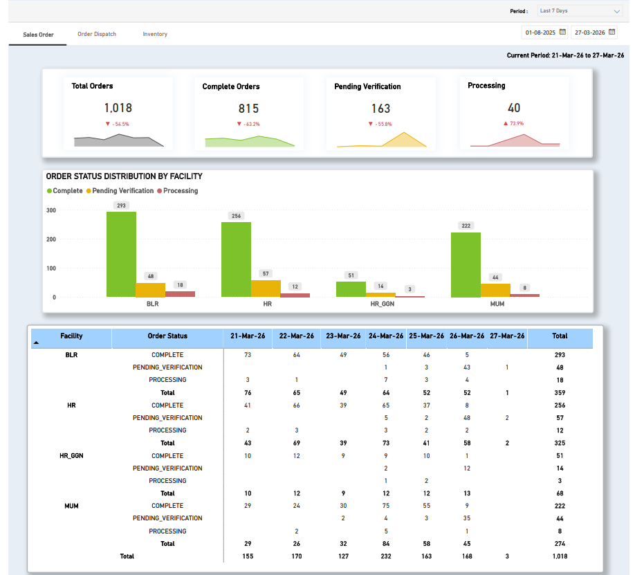
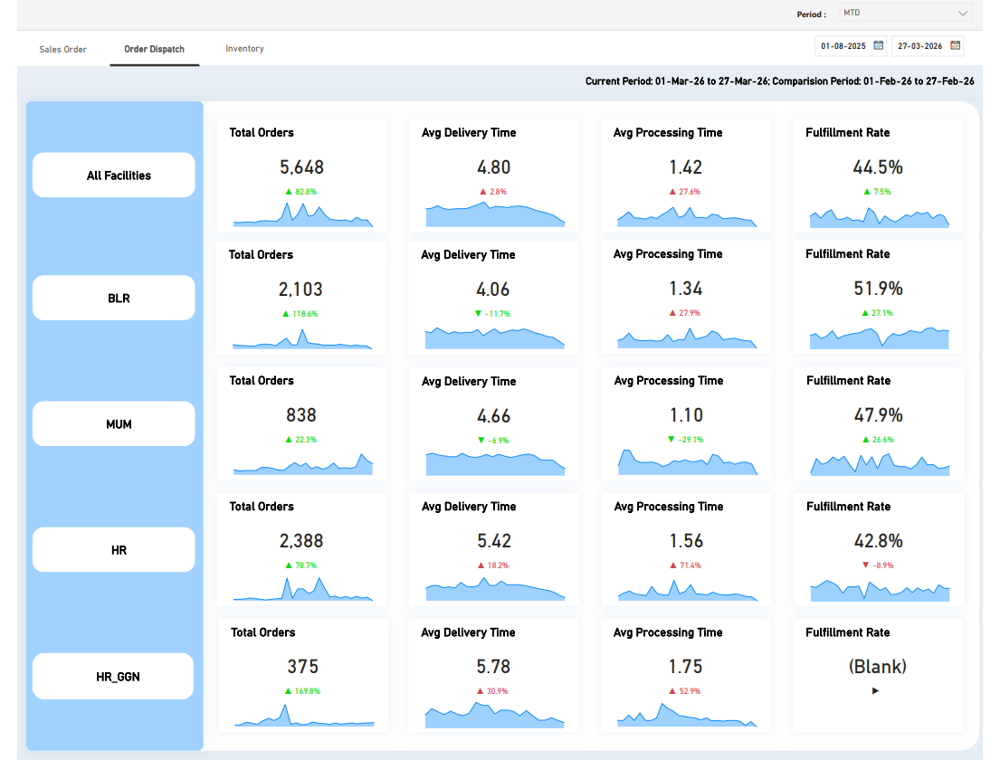
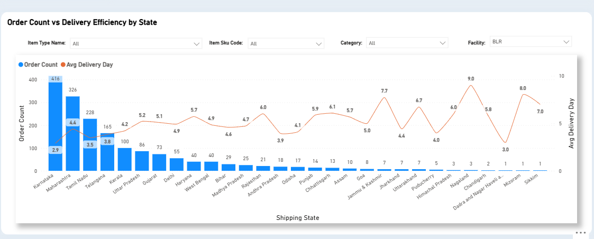
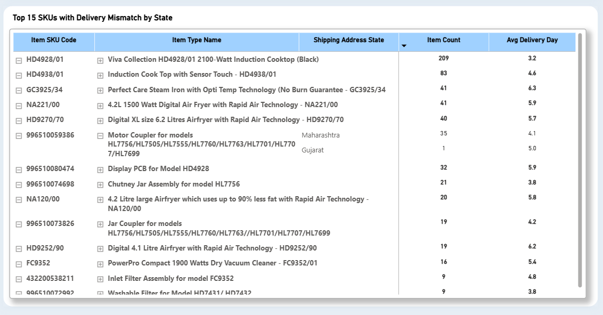
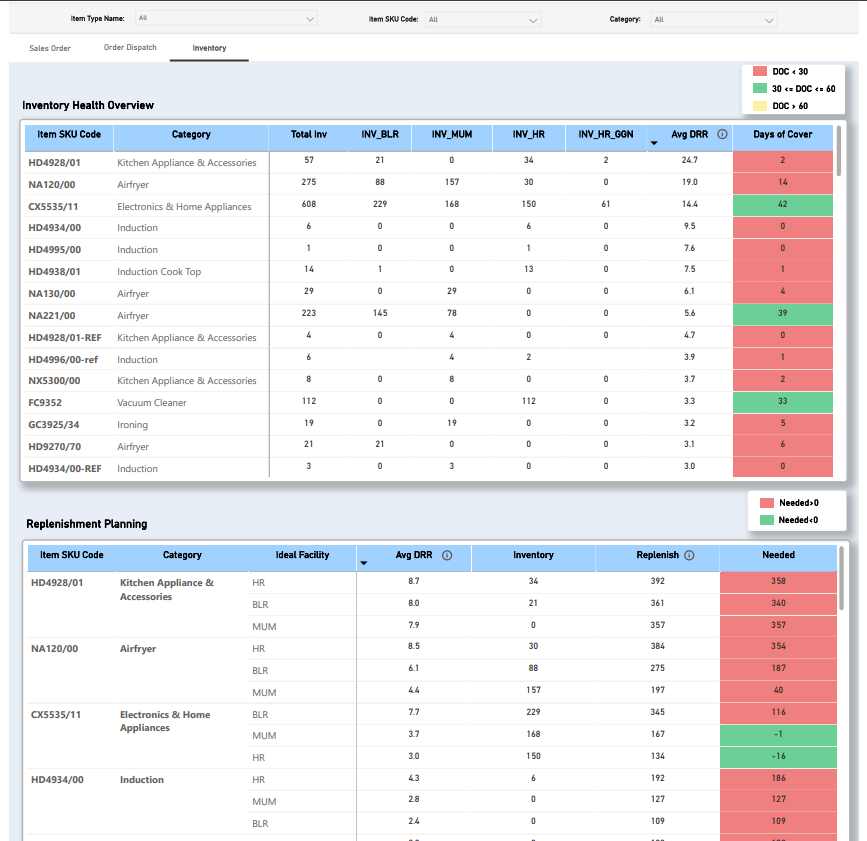

# Inventory Replenishment & Performance Intelligence Dashboard

**Tools:** Power BI · SQL · PostgreSQL · Unicommerce (Uniware)

---

## Background

A mid-to-large FMCG client operating across 4 warehouses 
(Bangalore, Haryana, Mumbai, Haryana-Gurgaon) approached 
us with a straightforward ask — they wanted visibility into 
their Unicommerce data which was being crawled and stored 
in our internal database. What started as a basic data 
visibility request turned into a full-scale operational 
intelligence dashboard once I started digging into what 
they actually needed to run their business better.

The core problems they were facing:
- No clear view of how each warehouse was performing 
  day-to-day
- No way to identify whether orders were being fulfilled 
  from the right warehouse or not
- Manual stock planning with no logic behind replenishment 
  quantities
- No understanding of which states were facing delivery 
  delays and why

---

## Page 1 — Sales Order Tracking

The first thing the client wanted was simple — how many 
orders are coming in and what is happening to them at 
each facility.

I built three views on this page:

**KPI Cards** — Total Orders, Complete Orders, Pending 
Verification, and Processing — with sparklines and 
period-over-period % change. Default view is Last 7 Days 
since that's what the team checked daily, but MTD, Last 
Month, and custom date range filters are available.

**Order Status Distribution by Facility** — A grouped 
bar chart breaking down Complete, Pending Verification, 
and Processing orders per warehouse. This gave the client 
an instant visual of which facility had a backlog building 
up on any given week.

**Day-on-Day Matrix** — A detailed table showing each 
facility's order status split across individual dates. 

---

## Page 2 — Order Dispatch & Fulfillment Analysis

This page involved the most logic and became the most 
valuable part of the dashboard.

### Facility Performance KPIs

The client wanted to know not just how many orders went 
out but *how well* they went out. I calculated:

- **Avg Delivery Time** — difference between delivery 
  date and order date
- **Avg Processing Time** — difference between dispatch 
  date and order date
- **Fulfillment Rate** — this was the big one

### The Fulfillment Rate Problem

The client had a fundamental issue he couldn't quantify — 
products going out of stock at one warehouse would get 
fulfilled from another warehouse in a completely different 
region. A customer ordering from Maharashtra might get 
their product shipped from Haryana, leading to longer 
delivery times and higher logistics costs. But nobody 
knew how often this was actually happening or which 
warehouses were the worst offenders.

To solve this, I built a **Facility-State Mapping table** 
from scratch — manually mapping all 37 Indian states and 
UTs to their ideal fulfillment warehouse based on 
geographic proximity. I then merged this into the sales 
data so every order had two columns: the warehouse that 
*actually* fulfilled it and the warehouse that *should* 
have fulfilled it.

From this, I calculated Fulfillment Rate using DAX:
```dax
FacilityMatch = 
IF (
    'Sales Data'[Facility] = 'Sales Data'[Ideal Facility],
    "Match",
    "Mismatch"
)

Correctly Fulfilled Orders = 
CALCULATE(
    DISTINCTCOUNT('Sales Data'[Sale Order Code]),
    KEEPFILTERS('Sales Data'[Facility] = 'Sales Data'[Ideal Facility]),
    'Sales Data'[Sale Order Status] <> "CANCELLED"
)

Fulfillment Rate = 
DIVIDE(
    [Correctly Fulfilled Orders],
    DISTINCTCOUNT('Sales Data'[Sale Order Code])
)
```

This gave the client a clear % per warehouse showing 
how often orders were going out from the right location. 
It also became the foundation for the replenishment 
planning on Page 3 — if a warehouse has low fulfillment 
rate, it signals a stock problem that needs fixing.

### State-wise Delivery Efficiency

A dual-axis chart showing order volume and average 
delivery days per shipping state. The client used this 
to understand which states were underserved — high order 
volume with high delivery days signals either a warehouse 
coverage gap or a logistics issue. This view also sparked 
internal discussions around potentially opening a new 
warehouse in a high-volume, high-delay region.

### Mismatched SKUs by State

The final view on this page lists SKUs that were 
fulfilled from a non-ideal warehouse, broken down by 
state — showing item count and average delivery day. 
Filters from the delivery efficiency chart (category, 
SKU, facility) carry over to this table, making it easy 
to drill into specific problem areas quickly.


## Page 3 — Inventory Health & Replenishment Planning

### Inventory Health Overview

A SKU-level table showing current inventory split across 
all 4 warehouses, along with total inventory and a 
weighted Average DRR (Daily Run Rate).

The DRR logic was something the client specifically 
requested — rather than a simple rolling average, they 
wanted recent sales to carry more weight:

50% weight on last 7 days, 30% on last 15, 20% on last 
30 — so the DRR reacts quickly to recent demand spikes 
rather than being dragged down by older slow periods.

Days of Cover = Inventory / Avg DRR, color coded:
- 🔴 Red — DOC < 30 (critical, needs immediate action)
- 🟢 Green — DOC 30–60 (healthy stock level)
- 🟡 Yellow — DOC > 60 (overstocked)

I added a tooltip on the DRR column explaining the 
weighted formula so anyone on the client's team using 
the dashboard could understand the logic without 
needing to ask.

### Replenishment Planning

This table was built entirely on the Ideal Facility 
logic. Rather than showing what inventory exists at the 
warehouse that fulfilled an order, it shows inventory 
at the warehouse that *should* be fulfilling orders for 
that region. This gives a more accurate picture of 
whether the right warehouse actually has enough stock.

The replenishment target is set at 45 days of cover:

Positive Needed = units to be restocked (shown in red)
Negative Needed = surplus stock (shown in green)

The client used this table directly in weekly inventory 
planning meetings to decide how much stock to move 
between warehouses and what to reorder.

---

## Data Architecture
```
PostgreSQL Database
    ├── Sales Data (via Unicommerce crawler)
    └── Inventory Data (via Unicommerce crawler)
            ↓
Power BI Data Model
    ├── Sales Data + Ideal Facility (merged via 
    │   Facility-State Mapping table)
    ├── Inventory Data
    ├── Facility-State Mapping (built manually)
    ├── Calendar Table
    └── Master SKU Table
```

---

## Key Business Impact

- Client could identify underperforming warehouses 
  by fulfillment rate for the first time
- Mismatched SKU analysis revealed which products 
  needed stock redistribution across warehouses
- Weighted DRR gave a more accurate replenishment 
  signal compared to simple averages
- State-wise delivery analysis opened discussions 
  around warehouse expansion strategy
- Weekly manual stock planning effort reduced 
  significantly with automated replenishment quantities

---

## Screenshots







---

## SQL Queries

Core data extraction queries are available in the 
`/sql` folder:
- `sales_order_extraction.sql`
- `inventory_extraction.sql`  
- `facility_state_mapping.sql`

---

*Data anonymized. Client and product names removed.*
